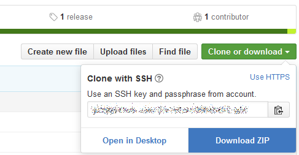

Intro to R, 2018 Fall
================
John Little
2019-01-14

<!-- Edit the README.Rmd.  Readme.md is auto genererated -->
README
======

-   Code

    -   <https://is.gd/2018r1>
    -   <https://is.gd/2018r2>

-   Repo -- Intro2R repo

    -   <https://is.gd/intro2r_2018fall>

This repository contains supporting datasets and files for our [*Intro to R*](https://rfun.library.duke.edu/intro2r/) workshop by the [Data & Visualization Services Department](http://library.duke.edu/data), Duke University Libraries. You can find more information about our future and past [workshops](http://library.duke.edu/data/news)

-   our *guide* can be found at our [Rfun site](https://rfun.library.duke.edu/intro2r/)

-   More on R [(then, scroll down to "R Learning Resources".) Includes video captures](https://library.duke.edu/data/guides)

Outline
-------

1.  Download the zipped repository 
2.  Unzip/expand the zipped repo as a folder **in your Documents Directory**
3.  Launch RStudio
4.  File &gt; New Project...
5.  Existing Directory: Browse to your unzipped copy in the documents directory

    1.  Literate Coding: brief explanation
        1.  New Code Chunk: *Ctrl+Alt+I*
        2.  R Markdown: brief explanation
    2.  [`library(tidyverse)`](https://tidyverse.org)

6.  Load & View Tibble (data frame)

7.  Data Structure & Data Types (brief)

8.  [`dplyr`](http://dplyr.tidyverse.org/) -- part of tidyverse

    1.  `filter` rows
    2.  `arrange` rows by variables
    3.  `select` columns
    4.  `mutate` derive cells / new variables
    5.  `count` column totals
    6.  `summarize` grouping reports

9.  **Now You Try It.** Hands on exercises.

    1.  [exercise\_01.Rmd](exercise_01.Rmd)
    2.  [exercise\_02.Rmd](exercise_02.Rmd)
    3.  [answers.Rmd](answers.Rmd)

10. Basic Exploratory Data Analysis

    1.  Read in new datasets
    2.  `library(skimr)`

11. More `dplyr` -- join two datasets

    1.  `left_join` to merge data

12. More Visualize with `ggvis` (syntactically simpler than ggplot2, but...)

    1.  Basic visualization (Scatter Plot, Box Plot, Histogram, Bar Chart)
    2.  Take the ggplot2 workshop, or see the [materials](https://github.com/data-and-visualization/ggplot2-S18)
    3.  Resource: <https://rfun.library.duke.edu/intro2r/visualization.html>

13. Our Training Materials

    1.  R we having fun yet‽ <https://rfun.library.duke.edu>. Training materials for R.

        -   [2018 Workshops](http://rfun.library.duke.edu/2017/11/30/tidyverse-workshops-coming-in-january/): Intro to 2 / Visualization / Shiny / Mapping / Git / R Markdown

    2.  Full DVS [workshop series](https://library.duke.edu/data/news/past-workshops)

14. Questions: [Walk-in schedule](https://library.duke.edu/data/about/schedule) and by appointment [Data Science Consulting](https://library.duke.edu/data/about)

License
-------

Shareable via Creative Commons: [CC-BY-NC](https://creativecommons.org/licenses/by-nc/4.0/)  
