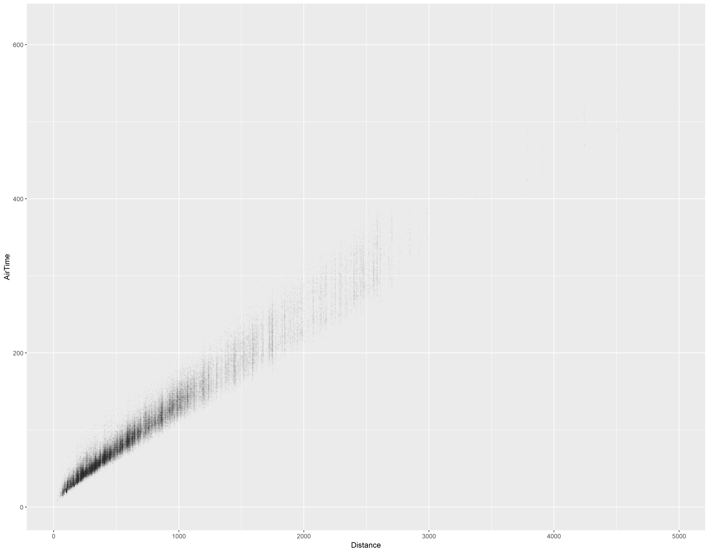

Data importing can be a time sink and a major bottleneck.  If your data are large, you'll want to import the data in the most efficient manner.  The table below give some guides lines for import, depending on the size of your data.

Data Size | Library Package
--- | ---
250 MB < | [tidyverse::readr](https://readr.tidyverse.org/)
250 MB to 3 GB | [data.table](https://github.com/Rdatatable/data.table/wiki)
3GB > | Import data from a database tool using [dbplyr](https://dbplyr.tidyverse.org/)


# Practice Data

2008.csv is a 660 MB file compressed to 176 MB:  [source](https://people.duke.edu/~jrl/bigdata/2008.zip).

## Package Libraries

- *reading in the data*

    - `readr::read_csv()` (tidyverse -- better than read.csv because it does not convert strings to factors) 
    - `data.table::fread()` (competitive advantage when reading data larger than 250 Mb)
    
```{r message=FALSE, warning=FALSE}
library(tidyverse)
library(data.table)
```


## Load Data

### read_csv

A standard import with `read_csv` for a 600 MB file will take a long time to load.  You can see example code below.  The code is not executed because of the time delay.

```r
air <- read_csv("data/2008.csv")
```

## data.table

Loading larger datasets is much faster with data.table::`fread()`

The [data.table package](https://github.com/Rdatatable/data.table/wiki) is useful for importing data larger than 1-2 GB.  It's often a good idea to convert the imported data frame to a tibble using code such as the following:  `my_tibble <- as_tibble(my_imported_data.table)`

```{r}
download.file("https://people.duke.edu/~jrl/bigdata/2008.zip", "data/2008.zip")

unzip("data/2008.zip", exdir = "data")

flights <- 
  fread("data/2008.csv", showProgress = FALSE)

flights2 <- as_tibble(flights)  # convert to Tibble
```


### Compare import times 

using the `system.time()` function we can compare the processing and elapsed time of these two different data import functions.


| Function | user | system | elapsed |
| ---------|-----:|-------:|--------:|
readr::`read_csv("data/2008.csv")` | 94.01 | 84.73 | 181.98 
data.table::`fread("data/2008.csv")` | 6.78 | 0.69 | 2.72 


## Preserve data table as a binary matrix

An alternative to saving your data is to store the data in a binary matrix.  It may be convenient to preserve the data table as an **.Rdata** file.

However, this is often much slower than import via `fread()`.  Below is non-executed code example for saving an `.Rdata` matrix.

```r
save(flights, file="data/flights.Rdata")
system.time(load(file="data/flights.Rdata"))
```

## Sampling the data

The following sections show methods of sampling the data so that you can work with representative subsets of data.  Using dplyr::`sample_frac()` can be an effective way to decrease your elapsed investigation times by decreasing computational processing.  `sample_frac` makes it easier to select random rows from a table.

use dplyr::`sample_frac()`

Subset the flights dataset with a sample of flights.

```{r}
set.seed(20180329)
flights_subset = flights %>% sample_frac(0.2)
```

For example, compare object sizes of the full-sized data object (`flights`) versus the sampled (`flights_subset`) data object created via the `sample_frac` function.

```{r message=FALSE, warning=FALSE}
library(pryr)
object.size(flights)
object.size(flights_subset)
```

## Free up memory

When working with a sample subset, you'll probably benefit from removing the original object and doing some basic garbage collection.

```{r}
rm(flights)
rm(flights2)
gc()  # garbage collection
```

## Other Useful Tools

### Progress Bars

You know, at least you can see something moving along and indicating some progress.  Sometimes that is comforting.

```{r}
p <- progress_estimated(50, min_time = 0)
for(i in 1:50)
{
  # Calculate something compliated
  Sys.sleep(0.1)
  
  p$tick()$print()
}
```

## BenchMarking

```{r}
system.time(rnorm(1e6))
system.time(rnorm(1e4) %*% t(rnorm(1e4)))
```

# Benchmark

The [`microbenchmark` package](https://cran.r-project.org/web/packages/microbenchmark/) can help you estimate how long your processes will take after working with the sample subset.  Another bench marking alternative is the `rbenchmark` package.


```{r}
library(microbenchmark)

d <- abs(rnorm(1000))
r <- microbenchmark(
      exp(log(d)/2),
      d^0.5,
      sqrt(d),
      times = 1000
    )
print(r)
```

# Profiling

[`profvis`](https://rstudio.github.io/profvis/) will  create interactive visualizations to help you understand how R spends its time.

```{r}
library(profvis)

set.seed(20180329)
flights_small<- flights_subset %>% sample_n(100000)
profvis({
  m = lm(AirTime ~ Distance, data = flights_small)
  plot(AirTime ~ Distance, data = flights_small)
  abline(m, col = "red")
})
```

# PNG Graphics

```{r message=FALSE, warning=FALSE}
png("time_vs_dist.png", width=1024, height=800)
ggplot(flights_small, aes(y=AirTime,x=Distance)) +
  geom_point(alpha=0.01, size=0.5)

ggsave("time_vs_dist_ggsave.png")
```





## Footnote

The data and techniques were gathered from a 2018 DataFest workshop by Michael Akenda.

- [michael akande](https://github.com/akandelanre)
- http://www.stat.duke.edu/~oma9/datafest/df2018
- http://www2.stat.duke.edu/~oma9/datafest/df2018/data/ 
